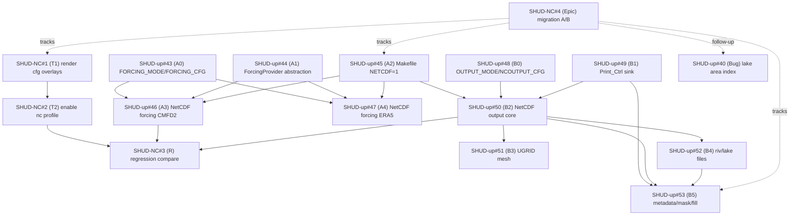

# Issue DAG（跨仓库 Backlog / 依赖分析）

> Last updated: 2026-02-08  
> Repos: `DankerMu/SHUD-NC` (meta) / `DankerMu/SHUD-up` (solver) / `DankerMu/AutoSHUD` (pipeline)

本文档用于把三个仓库的 issue 关系整理成 **DAG（依赖图）** 与 **推荐串行实现顺序**，便于按 OpenSpec（父仓库）统一管理跨仓库 backlog。

## 1. 总览（当前仓库状态）

- `DankerMu/AutoSHUD`：当前无 issues（0）。
- `DankerMu/SHUD-NC`：NetCDF 迁移相关 issues（Epic + T1/T2/R）均已关闭。
- `DankerMu/SHUD-up`：NetCDF 迁移相关 issues（A0–A4、B0–B5）均已关闭；TSR/time 等历史 issues 也均已关闭。

> 注：本文件关注“NetCDF forcing + NetCDF output 迁移”的关键路径与跨仓库依赖；TSR/time 相关 issue 另见附录（可选）。

---

## 2. NetCDF 迁移（OpenSpec 驱动）DAG

### 2.1 节点（Issue ↔ OpenSpec change ↔ PR）

| Area | Repo | Issue | OpenSpec change id | PR（merged） |
|---|---|---:|---|---:|
| Meta-runner | SHUD-NC | #1 `[T1] render SHUD cfg overlays` | `update-meta-runner-render-shud-cfg` | #5 |
| Meta-runner | SHUD-NC | #2 `[T2] enable nc profile validate/run` | `update-meta-runner-nc-profile-run` | #6 |
| Forcing | SHUD-up | #45 `[A2] Makefile: NETCDF=1` | `add-shud-build-netcdf-flag` | #54 |
| Forcing | SHUD-up | #43 `[A0] Parse FORCING_MODE/FORCING_CFG` | `add-shud-forcing-mode-config` | #55 |
| Forcing | SHUD-up | #44 `[A1] ForcingProvider abstraction` | `refactor-shud-forcing-provider-abstraction` | #56 |
| Forcing | SHUD-up | #46 `[A3] NetCDF forcing: CMFD2` | `add-shud-netcdf-forcing-cmfd2` | #57 |
| Tools | SHUD-NC | #3 `[R] sampled regression compare` | `add-tools-regression-compare` | #7 |
| Forcing | SHUD-up | #47 `[A4] NetCDF forcing: ERA5 subset` | `add-shud-netcdf-forcing-era5` | #58 |
| Output | SHUD-up | #48 `[B0] Parse OUTPUT_MODE/NCOUTPUT_CFG` | `add-shud-output-mode-config` | #59 |
| Output | SHUD-up | #49 `[B1] Print_Ctrl sink interface` | `add-shud-printctrl-sink-interface` | #60 |
| Output | SHUD-up | #50 `[B2] NetCDF output core (ele + time)` | `add-shud-netcdf-output-core` | #61 |
| Output | SHUD-up | #51 `[B3] NetCDF output: UGRID mesh` | `add-shud-netcdf-output-ugrid-mesh` | #62 |
| Output | SHUD-up | #52 `[B4] NetCDF output: riv/lake` | `add-shud-netcdf-output-riv-lake` | #63 |
| Output | SHUD-up | #53 `[B5] NetCDF output: metadata/mask/fill` | `add-shud-netcdf-output-metadata-mask-fill` | #64 |
| Follow-up | SHUD-up | #40 `Fix lake area accumulation index` | (non-OpenSpec) | #65 |
| Epic | SHUD-NC | #4 `Epic: ... migration (A/B)` | (aggregate) | n/a |

### 2.2 依赖关系（DAG）

依赖信息来自各 issue body 内的 `<!-- deps:start --> ... <!-- deps:end -->` 区块（OpenSpec issue 模板）。

### 2.3 推荐串行实现顺序（Critical Path）

以 `DankerMu/SHUD-NC#4` 的 “Implementation order (serial)” 为准（目标是最小化返工，先把 runner 打通，再 forcing，再 output，再回归工具）。

1. `SHUD-NC#1`（T1）render cfg overlays
2. `SHUD-NC#2`（T2）enable nc profile validate/run
3. `SHUD-up#45`（A2）Makefile `NETCDF=1`
4. `SHUD-up#43`（A0）parse `FORCING_MODE/FORCING_CFG`
5. `SHUD-up#44`（A1）ForcingProvider abstraction
6. `SHUD-up#46`（A3）CMFD2 provider
7. `SHUD-NC#3`（R）regression compare tools（至少 forcing 抽样对比先上线）
8. `SHUD-up#47`（A4）ERA5 provider
9. `SHUD-up#48`（B0）parse `OUTPUT_MODE/NCOUTPUT_CFG`
10. `SHUD-up#49`（B1）Print_Ctrl sink interface
11. `SHUD-up#50`（B2）NetCDF output core (ele + time)
12. `SHUD-up#51`（B3）UGRID mesh
13. `SHUD-up#52`（B4）riv/lake files
14. `SHUD-up#53`（B5）metadata/mask/fill

Follow-ups（非关键路径）：
- `SHUD-up#40`：lake area index bugfix

---

## 附录 A：TSR / TimeContext（SHUD-up 历史 issues）

这些 issues 与 NetCDF 迁移不是同一条关键路径，但它们解释了为何近期出现 `TSR`、`time semantics`、`lake` 相关的修复提交与 PR。

- Time semantics（A1–A6）：`SHUD-up#1..#6`
- TSR（B0–B4 + B2a）：`SHUD-up#7..#12`
- TSR 验证链路（C1–C4）：`SHUD-up#13..#16`
- 文档（D1–D2）：`SHUD-up#17..#18`
- Lake 修复（X1 + area index）：`SHUD-up#19` / `SHUD-up#40`
- TSR daily forcing bias：`SHUD-up#41` / `SHUD-up#42`

