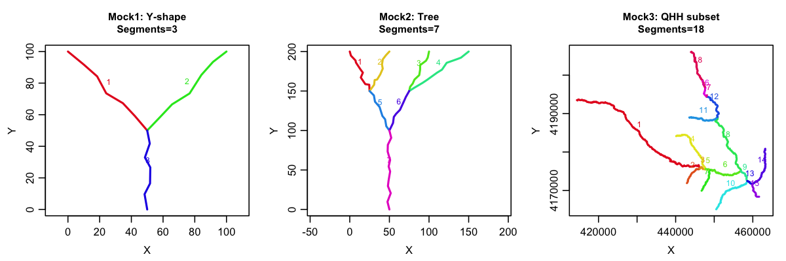
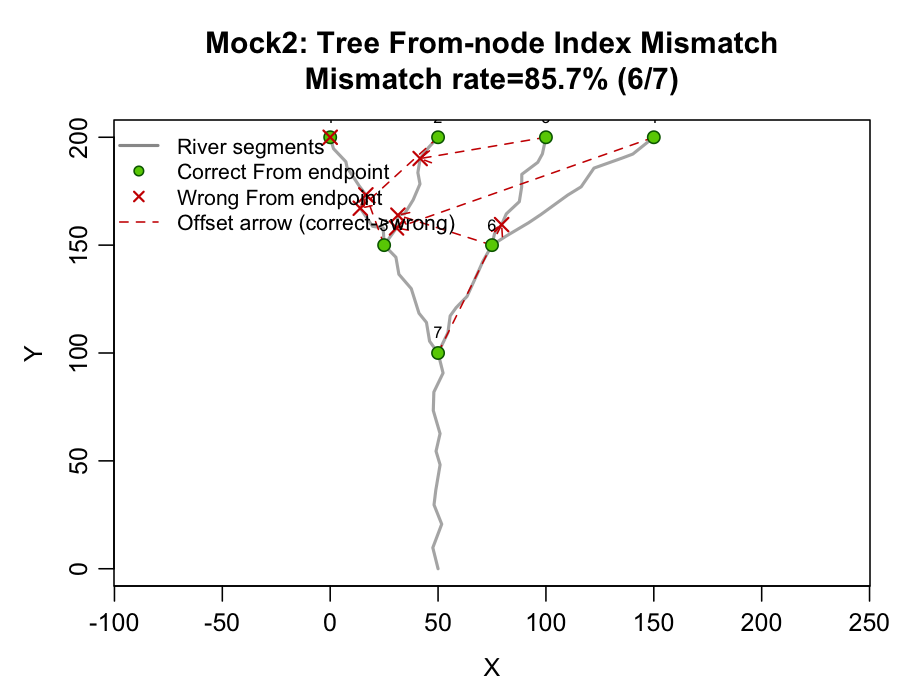
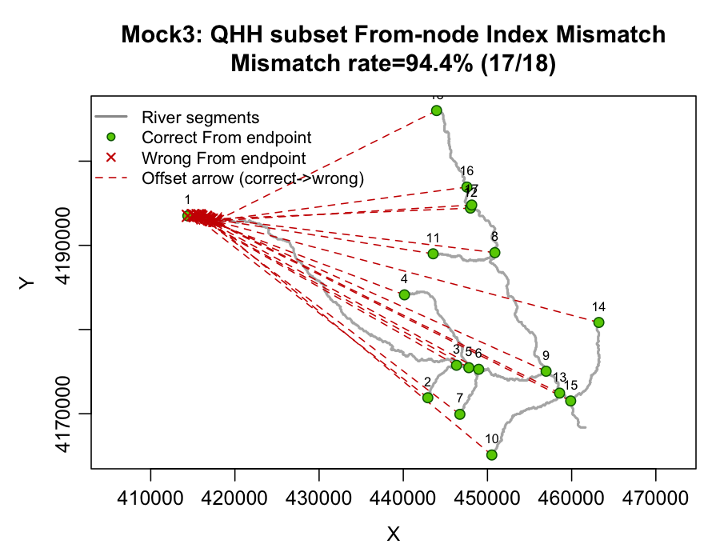
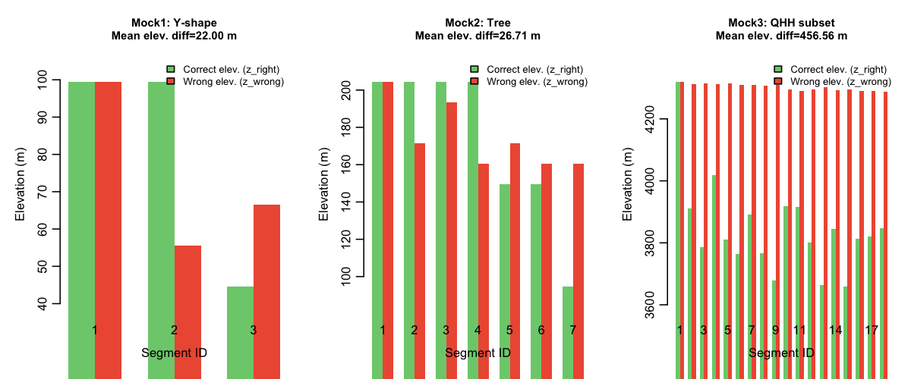
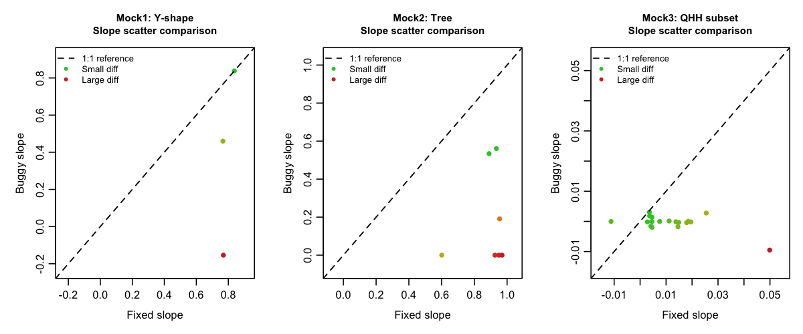
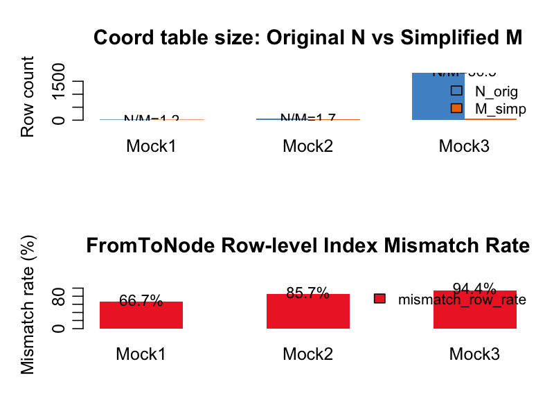
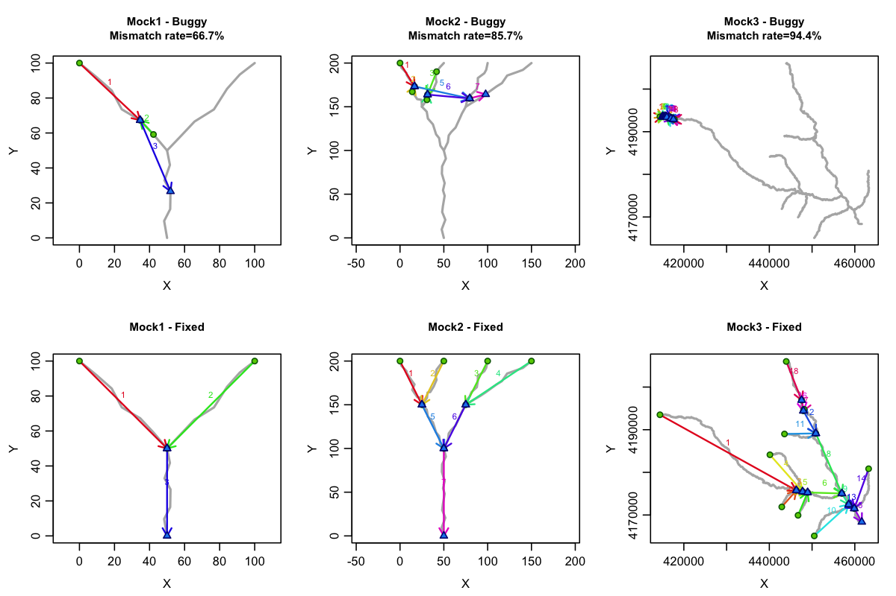

# rSHUD `shud.river()` FromToNode 索引错配 Bug 报告

> 报告日期: 2026-02-10（最后更新: 2026-02-12）
> 分支: `fix/river-index-mismatch`
> 测试环境: R 4.5.0, sf, terra, sp, raster (无 rgeos/rgdal)

---

## 0. 版本与文件指向

> **路径约定**：下表使用绝对路径（本机复现用）。相对于 SHUD-NC 仓库根目录 `$PROJ = /Users/danker/Desktop/Hydro-SHUD/SHUD-NC`，旧版 rSHUD 位于 `$PROJ/../rSHUD`。

### 0.1 旧版本 rSHUD（bug 发现源）

| 项目 | 路径 |
|------|------|
| 旧版 rSHUD 仓库 | `/Users/danker/Desktop/Hydro-SHUD/rSHUD` |
| `shud.river()` | `/Users/danker/Desktop/Hydro-SHUD/rSHUD/R/River.R` |
| `FromToNode()` (git HEAD, rgeos) | `/Users/danker/Desktop/Hydro-SHUD/rSHUD/R/GIS_RiverProcess.R:207-221` |
| `FromToNode()` (工作区未提交, sf) | 同上文件，`rgeos::gSimplify` → `sf::st_simplify` 的本地修改 |
| `extractCoords()` | `/Users/danker/Desktop/Hydro-SHUD/rSHUD/R/Func_Misc.R` |

### 0.2 新版本 rSHUD（SHUD-NC 子模块）

| 项目 | 路径 |
|------|------|
| 新版 rSHUD 子模块 | `/Users/danker/Desktop/Hydro-SHUD/SHUD-NC/rSHUD` |
| `shud.river()` | `/Users/danker/Desktop/Hydro-SHUD/SHUD-NC/rSHUD/R/River.R` |
| `FromToNode()` | `/Users/danker/Desktop/Hydro-SHUD/SHUD-NC/rSHUD/R/GIS_RiverProcess.R` |

两个版本的 `shud.river()` 代码完全相同，bug 相同。

### 0.3 QHH Baseline 生产数据（旧版 rSHUD 产出）

| 项目 | 路径 | 说明 |
|------|------|------|
| 生产输出 `.sp.riv` | `/Users/danker/Desktop/Hydro-SHUD/SHUD-NC/runs/qhh/baseline/input/qhh/qhh.sp.riv` | 2022-06-08 生成，1633 条河段 |
| 真实河网几何 | `/Users/danker/Desktop/Hydro-SHUD/SHUD-NC/runs/qhh/baseline/input/qhh/gis/river.shp` | 1633 条河段 |
| 原始河网（Step1 输入） | `/Users/danker/Desktop/Hydro-SHUD/SHUD-NC/runs/qhh/baseline/DataPre/pcs/stm.shp` | 504 条河段 |
| AutoSHUD 流程 | `/Users/danker/Desktop/Hydro-SHUD/SHUD-NC/AutoSHUD/Step3_BuidModel.R:202` | 调用 `shud.river()` |

### 0.4 SHUD 求解器

| 项目 | 路径 |
|------|------|
| BedSlope 读入 | `SHUD/src/ModelData/MD_readin.cpp:144` |
| BedSlope 钳制 | `SHUD/src/ModelData/MD_initialize.cpp:218` |
| MINRIVSLOPE 定义 | `SHUD/src/Model/Macros.hpp:47` |
| Manning 方程 | `SHUD/src/ModelData/MD_RiverFlux.cpp:20-45` |
| 河道状态方程 | `SHUD/src/ModelData/MD_f.cpp:162` |
| @point 读取（已注释） | `SHUD/src/ModelData/MD_readin.cpp:181` |

---

## 1. 问题概述

`rSHUD` 包的 `shud.river()` 函数在计算河段坡度（slope）和 From/To 节点坐标时，存在**索引体系错配**问题。该 bug 导致几乎所有河段的高程提取点偏离真实端点，进而产生错误的坡度值和节点坐标和高程
**影响范围**（仅限 `shud.river()` 第 28-44 行的 `ft` 索引路径）：
- `@river$Slope`（河段坡度）— **受影响** ✗
- `@point`（From/To 节点坐标和高程）— **受影响** ✗

**不受影响的字段**（通过独立的内部自洽代码路径计算）：
- `@river$Down`（下游拓扑关系）— 由 `sp.RiverDown()` 独立计算 ✓
- `@river$Type`（河流 Order）— 由 `sp.RiverOrder()` 独立计算 ✓
- `@river$Length`（河段长度）— 由 `rgeos::gLength()` 直接计算 ✓

**关键发现**：河网拓扑（谁是谁的下游）始终正确，这解释了为什么过往计算的流域结果拓扑始终连通。Bug 仅影响坡度和节点坐标/高程。

**严重程度**：在 QHH 实际案例中，94.4% 的河段坡度受影响，From 端点高程偏差中位数达 **472 米**。

---

## 2. Bug 机制详解

### 2.1 涉及的代码位置

| 文件 | 行号 | 函数 | 作用 |
|------|------|------|------|
| `rSHUD/R/River.R` | 15 | `shud.river()` | `xy = extractCoords(sp.slt)`（默认 `unique=TRUE`）— 提取原始几何的唯一顶点表 |
| `rSHUD/R/River.R` | 28 | `shud.river()` | `ft = FromToNode(sp.slt, simplify=TRUE)` — 获取 From/To 索引 |
| `rSHUD/R/River.R` | 30-31 | `shud.river()` | `xy[ft[,1], ]` — 用索引查表提取高程 |
| `rSHUD/R/GIS_RiverProcess.R` | 207-221 | `FromToNode()` | 内部简化几何后构建索引 |

### 2.2 根因：两套索引体系混用

```
shud.river() 的执行流程：

  第 15 行: xy = extractCoords(sp.slt)
            ↓
            原始几何 → unique 顶点表（N 行，`extractCoords()` 默认 `unique=TRUE`）
            例如 Mock3（QHH 真实子集，18 段）: N = 1827
            例如 QHH 生产全量（1633 段，river.shp）: N = 41280

  第 28 行: ft = FromToNode(sp.slt, simplify=TRUE)[, 2:3]
            ↓
            FromToNode 内部:
              1. gSimplify(sp, tol=...) → 简化几何（减少中间顶点）
              2. coord = extractCoords(sp_simplified) → 简化后的 unique 顶点表（M 行）
                 （R 惰性求值：coord 默认参数在 gSimplify 之后才求值）
              3. NodeIDList(sp_simplified, coord) → 索引基于 M 行表
            ↓
            ft 的索引值 ∈ {1, 2, ..., M}
            例如 Mock3（QHH 子集）: M = 50
            例如 QHH 生产全量: M = 1678（tol≈2.85 km 时简化后几乎只保留端点）

  第 30 行: zf = raster::extract(dem, xy[ft[,1], ])
            ↓
            ft 的索引是基于简化后 coord（1..M），却被当作原始 xy（1..N）的行号使用
            → 实际取到的是 xy 表中“行号等于 ft”的点（必然落在 xy 的前 M 行）
            → 端点坐标/高程被系统性错配，进而影响 `@river$Slope` 与 `@point`
```

### 2.3 R 惰性求值机制

`FromToNode` 的函数签名：

```r
FromToNode <- function(sp, coord = extractCoords(sp, unique = TRUE), simplify = TRUE)
```

`coord` 是默认参数，R 采用**惰性求值**（lazy evaluation）：`coord` 的表达式 `extractCoords(sp, unique=TRUE)` 不会在函数调用时立即求值，而是在 `coord` 第一次被使用时才求值。此时 `sp` 已经被 `gSimplify` 重新赋值为简化后的几何对象，因此 `coord` 实际上是简化后的顶点表。

这意味着 **`FromToNode` 内部是自洽的**——`coord` 和 `sp` 都来自简化后的几何，索引一致。但 `shud.river()` 的 `xy` 来自原始几何，与 `ft` 的索引体系不匹配。

### 2.4 图解

（以下以 Mock3（QHH 子集，N=1827、M=50）为例图解行号错配。）

```
原始几何 (N=1827 个唯一顶点):
  xy[1]  = 河段1的第1个顶点
  xy[2]  = 河段1的第2个顶点
  ...
  xy[50] = 河段1的第50个顶点（某个中间点）
  ...
  xy[1827] = 最后一个顶点

简化后几何 (M=50 个唯一顶点):
  coord[1]  = 河段A的起点
  coord[2]  = 河段A的终点
  coord[3]  = 河段B的起点
  ...
  coord[50] = 最后一个端点

FromToNode 返回: ft[1,1] = 3  (表示"河段1的From端点是 coord 表的第3行")

Bug: xy[3, ] ≠ coord[3, ]
     xy[3] 是原始表的第3个顶点（河段1的某个中间点）
     coord[3] 是简化表的第3个顶点（河段B的起点）
     → 通常不是同一个节点（空间偏差可达 km 级）
```

补充说明：索引错配不是“随机噪声”。错配后的点由两张表的遍历/编号顺序共同决定；在树状河网的 QHH 生产数据中，错配会表现为**支流段端点高程关系的系统性翻转**，从而导致负坡度比例异常膨胀（见 §8b.2）。

---

## 3. 测试方案

### 3.1 Mock 数据设计

为验证 bug 的存在和修复方案的有效性，构建了 3 套递进复杂度的 mock 数据：

| 数据集 | 描述 | 河段数 | 顶点数 | 拓扑 | 目的 |
|--------|------|--------|--------|------|------|
| Mock1 | Y 形合成河网 | 3 | 21 (unique 19) | 2 支流 → 1 干流 | 最小可复现案例 |
| Mock2 | 树形合成河网 | 7 | 68 (unique ~62) | 4 支流 → 2 中间 → 1 干流 | 多级汇流传播 |
| Mock3 | QHH 真实子集 | 18 | 1844 (unique 1827) | 真实河网拓扑 | 实际影响评估 |

#### Mock1: Y 形合成河网

```
拓扑结构:
  Seg1: (0,100) → 5个锯齿中间点 → (50,50)   [支流1]
  Seg2: (100,100) → 5个锯齿中间点 → (50,50)  [支流2]
  Seg3: (50,50) → 5个锯齿中间点 → (50,0)     [干流/出口]

DEM: 10×10 栅格, extent(-5,105,-5,105), 高程 = y 坐标（北高南低）
种子: set.seed(42)
```

#### Mock2: 树形合成河网

```
拓扑结构（二级汇流）:
  Seg1: (0,200) → (25,150)     [支流 L1a, 10 顶点]
  Seg2: (50,200) → (25,150)    [支流 L1b, 10 顶点]
  Seg3: (100,200) → (75,150)   [支流 R1a, 10 顶点]
  Seg4: (150,200) → (75,150)   [支流 R1b, 10 顶点]
  Seg5: (25,150) → (50,100)    [中间 L2, 8 顶点]
  Seg6: (75,150) → (50,100)    [中间 R2, 8 顶点]
  Seg7: (50,100) → (50,0)      [干流, 12 顶点]

DEM: 20×20 栅格, extent(-10,160,-10,210), 高程 = y 坐标
种子: set.seed(123)
```

#### Mock3: QHH 真实子集

```
来源: runs/qhh/baseline/DataPre/pcs/stm.shp (504 条河段)
选取策略: 以最长河段为种子，通过端点空间连通性扩展，收集 18 条拓扑连通河段
DEM: 从 dem.tif 裁剪，bbox + 500m 缓冲
投影: EPSG:32647 (UTM 47N)
```

### 3.2 河网总览



**图 1** 展示了三套 mock 数据的河网几何。从左到右复杂度递增：
- **Mock1**（左）：最简 Y 形，3 条河段各 7 个顶点，中间点有 ±2 的随机锯齿偏移
- **Mock2**（中）：二级汇流树形，7 条河段共 68 个顶点，偏移量 ±3
- **Mock3**（右）：QHH 真实河网子集，18 条河段共 1844 个顶点，复杂的自然河道弯曲

每条河段的中间顶点越多，`st_simplify` 简化后减少的顶点越多，N/M 比值越大，索引错配越严重。

---

## 4. 测试结果

### 4.1 验证 1：坐标表行数差异

| 数据集 | N_orig (原始) | M_simp (简化后) | N/M 比值 | 简化率 |
|--------|---------------|-----------------|----------|--------|
| Mock1 Y形 | 19 | 16 | 1.19× | 15.8% |
| Mock2 树形 | 62 | 36 | 1.72× | 41.9% |
| Mock3 QHH | **1827** | **50** | **36.5×** | **97.3%** |

**结论**：`st_simplify` 在所有数据集上都显著减少了顶点数。Mock3（QHH 子集）的简化率高达 97.3%，意味着 1827 行的原始表被压缩到仅 50 行，索引体系完全不兼容。需要注意：QHH 生产全量（1633 段）在同一 `tol=(ext[2]-ext[1])*0.01` 规则下简化后 **M=1678**，并非“几十个点”（见 §8b.2）。

### 4.2 验证 2：索引错配复现

| 数据集 | 错配河段数 | 错配率 | 高程偏差 min | 高程偏差 median | 高程偏差 max | 高程偏差 SD |
|--------|-----------|--------|-------------|----------------|-------------|------------|
| Mock1 | 2/3 | **66.7%** | -44 | 0 | 22 | 33.6 |
| Mock2 | 6/7 | **85.7%** | -44 | 0 | 66 | 36.7 |
| Mock3 | 17/18 | **94.4%** | 0 | **472.5** | **638** | 148.0 |

### 4.3 索引错配可视化

#### Mock1: Y 形河网


**图 2a** 展示了 Y 形河网的索引错配情况。绿色圆点是每条河段的**真实 From 端点**（即河段第一个顶点），红色叉号是 bug 导致取到的**错误点**。红色虚线箭头表示偏移方向和距离。

在 3 条河段中，2 条的 From 端点被错误定位。由于 N/M 比值仅 1.19×，部分索引碰巧仍指向正确位置（第 1 条河段），但这只是巧合。

#### Mock2: 树形河网



**图 2b** 展示了树形河网的错配。7 条河段中 6 条受影响（85.7%）。可以观察到：
- 错误点（红叉）散布在河网的各个位置，与对应河段的真实端点（绿点）不再一一对应
- 偏移箭头没有单一方向偏置；其空间形态由两张坐标表的遍历顺序共同决定，因此看起来“无规律”，但并非随机噪声

#### Mock3: QHH 真实河网



**图 2c** 展示了 QHH 河网子集（Mock3）的错配。这是最直观的案例之一：
- 18 条河段中 17 条错配（94.4%）
- 在该子集上 N/M 比值高达 36.5×，ft 索引最大值为 50，因此在 buggy 路径下只能访问原始 `xy` 的前 50 行（见 §2.2），这些行全部来自前几条河段的顶点
- 在该子集上错误点高度集中在河网的一小段区域内，而非分布在各河段的真实端点上
- 高程偏差中位数 472m，最大 638m——在山区流域中，这意味着坡度计算完全失真
（对比：QHH 生产全量中 M=1678，错配点不再集中于极小区域，但负坡度会呈现支流段的结构性膨胀，见 §8b.2。）

### 4.4 高程偏差对比



**图 3** 以柱状图对比了每条河段 From 端点的正确高程（绿色）与错误高程（红色）：
- **Mock1/2**（合成数据）：DEM 高程 = y 坐标，偏差反映了空间位置的偏移量
- **Mock3**（真实数据）：偏差极为显著，多数河段的错误高程与正确高程相差数百米

### 4.5 坡度对比



**图 4** 以散点图对比了修复前（buggy）和修复后（fixed）的河段坡度：
- 黑色虚线为 1:1 参考线，点越偏离该线说明 bug 影响越大
- **Mock3** 的偏离最为严重，多数点远离 1:1 线，说明 bug 导致的坡度计算在真实数据上完全不可信

### 4.6 验证 3：修复方案验证

| 数据集 | fixed_max_abs_diff | 高程偏差 (修复后) | 结论 |
|--------|-------------------|-------------------|------|
| Mock1 | **0** | 全部 0 | 修复有效 |
| Mock2 | **0** | 全部 0 | 修复有效 |
| Mock3 | **0** | 全部 0 | 修复有效 |

修复方案：`FromToNode(sl, coord=xy, simplify=FALSE)`

修复后，`ft` 索引直接对应 `xy` 的行号，`fixed_from` 与每条河段的真实首顶点完全一致（max_abs_diff = 0），高程偏差归零。

### 4.7 汇总统计



**图 5** 上半部分展示了 3 套数据的原始/简化顶点数对比，下半部分展示了错配率。可以清晰看到：
- N/M 比值越大，错配率越高
- Mock3（QHH 子集）的 N/M 比值（36.5×）和错配率（94.4%）远超合成数据

### 4.8 拓扑连接对比



**图 6** 以 2×3 布局对比了 3 套 mock 数据在 bug（上行）和修复后（下行）的 From→To 拓扑连接：

- **上行（Buggy）**：彩色箭头从错误的 From 点指向错误的 To 点。由于索引错配，箭头起止点不在河段端点上，视觉上呈现“看似乱飞/交叉”的状态——箭头跨越河段、指向非对应端点位置，`@point` 的空间连接失真。Mock3（QHH 子集）尤为明显：由于该子集 ft 索引最大值为 50，只能访问 1827 行原始表的前 50 行，导致箭头集中在河网的一小段区域内
- **下行（Fixed）**：箭头精确连接每条河段的首尾端点，拓扑连通、方向一致

需要强调的是：**这里展示的是 `@point` 中记录的 From/To 坐标的错误**，而非 `@river$Down` 的拓扑关系。`Down` 字段（谁是谁的下游）始终正确，不受此 bug 影响。图中的"拓扑断裂"仅指 `@point` 中存储的节点坐标偏离了真实河段端点。

---

### 5.1 最小修复（推荐）

**文件**: `rSHUD/R/River.R` 第 28 行

```r
# 修复前（bug）:
ft = rbind(FromToNode(sp.slt, simplify=TRUE)[, 2:3])

# 修复后:
ft = rbind(FromToNode(sp.slt, coord=xy, simplify=FALSE)[, 2:3])
```

**原理**：显式传入 `coord=xy`（原始几何的顶点表），并设置 `simplify=FALSE` 跳过内部简化。这样 `FromToNode` 使用 `xy` 作为坐标参考表，返回的索引直接对应 `xy` 的行号，消除索引体系不一致。

### 5.2 影响分析

| 项目 | 说明 |
|------|------|
| 修改范围 | 仅 1 行代码 |
| 向后兼容 | `FromToNode` 的 API 不变，只是调用方式改变 |
| 性能影响 | 跳过 `gSimplify` 后，`NodeIDList` 的 `xy2ID` 需要在更大的 coord 表上匹配，O(N×M) 开销增加。但 `shud.river()` 不是热路径，可接受 |
| 副作用 | `sp.RiverDown()` 和 `sp.RiverOrder()` 不受影响（它们内部自洽） |

### 5.3 替代方案 A：保留 simplify 的等价修复

```r
# 显式传入 coord=xy，但保留 simplify=TRUE
ft = rbind(FromToNode(sp.slt, coord=xy, simplify=TRUE)[, 2:3])
```

**原理**：显式传 `coord=xy` 覆盖默认参数后，惰性求值不再生效。`FromToNode` 内部仍做简化（减少中间顶点加速匹配），但 `NodeIDList` 使用的 `coord` 始终是原始的 `xy` 表。简化后的端点是原始顶点的子集，因此在 `xy` 中能精确匹配。

**优势**：保留 `simplify` 的性能收益（简化后河段只有起止两点，`NodeIDList` 遍历更少顶点）。

**前提条件**：简化算法（Douglas-Peucker）产出的端点必须是原始顶点的精确子集（无浮点漂移）。`rgeos::gSimplify` 和 `sf::st_simplify` 均满足此条件。

### 5.4 替代方案 B：FromToNode 内部防呆

```r
FromToNode <- function(sp, coord = extractCoords(sp, unique = TRUE), simplify = TRUE) {
  coord <- force(coord)  # 强制在 simplify 之前求值
  if (simplify) {
    # ... gSimplify / st_simplify ...
  }
  # coord 始终来自调用时的 sp（未简化），索引自洽
}
```

**优势**：从根源上消除惰性求值陷阱，任何调用方式都不会再出问题。

### 5.5 边界风险：xy2ID 严格匹配

`xy2ID` / `rowMatch` 使用 **严格相等**（`== 0`）匹配坐标。若未来简化算法产生非原始顶点（如拓扑保持简化的插值点）或发生浮点精度漂移，匹配将返回 0 索引，把"错配"问题变为"缺失"问题。

- 当前 fix（`simplify=FALSE` 或显式传 `coord`）可规避
- 长期建议：在 `xy2ID` 中加入容差匹配（`abs(diff) < tol`），或改用空间索引

---

## 6. 版本对比

| | 旧版 rSHUD (git HEAD) | 旧版 (工作区未提交) | 新版 (SHUD-NC 子模块) |
|---|---|---|---|
| `FromToNode` 简化引擎 | `rgeos::gSimplify` | `sf::st_simplify` | `rgeos::gSimplify` |
| `shud.river()` 第 28 行 | 相同 (bug) | 相同 (bug) | 相同 (bug) |
| 索引错配 bug | **存在** | **存在** | **存在** |

旧版工作区的唯一改动是将 `FromToNode` 中的 `rgeos::gSimplify` 替换为 `sf::st_simplify`（适配 rgeos 退役），但**未修复 `shud.river()` 的索引错配**。该 bug 自始至终存在于所有版本中。

---

## 7. 测试文件清单

| 文件 | 用途 |
|------|------|
| `testdata/mock_river/gen_mock1_y_shape.R` | Mock1 生成脚本 |
| `testdata/mock_river/gen_mock2_tree.R` | Mock2 生成脚本 |
| `testdata/mock_river/gen_mock3_qhh_subset.R` | Mock3 生成脚本 |
| `testdata/mock_river/mock1_y_shape.rds` | Mock1 数据 (SpatialLines + RasterLayer) |
| `testdata/mock_river/mock2_tree.rds` | Mock2 数据 |
| `testdata/mock_river/mock3_qhh_subset.rds` | Mock3 数据 |
| `testdata/mock_river/test_index_mismatch.R` | 索引错配验证脚本 |
| `testdata/mock_river/mismatch_report.json` | 结构化测试报告 |
| `testdata/mock_river/gen_report_figures.R` | 可视化生成脚本 |
| `testdata/mock_river/fig1_river_overview.png` | 河网总览图 |
| `testdata/mock_river/fig2a_mismatch_mock1.png` | Mock1 错配可视化 |
| `testdata/mock_river/fig2b_mismatch_mock2.png` | Mock2 错配可视化 |
| `testdata/mock_river/fig2c_mismatch_mock3.png` | Mock3 错配可视化 |
| `testdata/mock_river/fig3_elevation_diff.png` | 高程偏差对比 |
| `testdata/mock_river/fig4_slope_comparison.png` | 坡度对比 |
| `testdata/mock_river/fig5_summary.png` | 汇总统计 |
| `testdata/mock_river/fig6_topology_comparison.png` | Buggy vs Fixed 拓扑连接对比 |

---

## 8. 复现步骤

```bash
cd /Users/danker/Desktop/Hydro-SHUD/SHUD-NC
git checkout fix/river-index-mismatch

# 生成 mock 数据
Rscript testdata/mock_river/gen_mock1_y_shape.R
Rscript testdata/mock_river/gen_mock2_tree.R
Rscript testdata/mock_river/gen_mock3_qhh_subset.R

# 运行验证
Rscript testdata/mock_river/test_index_mismatch.R

# 生成可视化
Rscript testdata/mock_river/gen_report_figures.R
```

---

## 8b. 实际 QHH 生产数据验证

为验证 mock 测试结果的可靠性，直接检查了 QHH baseline 的实际输出文件。

### 8b.1 @point 坐标验证

对比 `river.shp`（1633 条河段的真实几何）与 `qhh.sp.riv` 第 3 块（@point）中记录的 From/To 坐标：

| 指标 | 值 | 说明 |
|------|-----|------|
| 样本量 | 前 100 条河段 | |
| From 坐标正确 (<1m) | **1/100 (1%)** | 仅第 1 条碰巧正确 |
| From 坐标错误 | **99/100 (99%)** | |
| 坐标偏差最小值 | 0.4 m | 第 1 条河段（巧合） |
| 坐标偏差中位数 | **28,103 m (28.1 km)** | 全部 100 条样本的中位数（排除唯一正确样本后为 28,233 m） |
| 坐标偏差最大值 | **65,429 m (65.4 km)** | |
| 坐标偏差均值 | 29,898 m (29.9 km) | 全部 100 条样本 |

**示例对比**（前 4 条河段）：

| 河段 | river.shp 真实 From | @point From | 偏差 |
|------|---------------------|-------------|------|
| Seg1 | (439639.7, 4206130.4) | (439639.7, 4206130) | 0.4 m ✓ |
| Seg2 | (441686.3, 4205838.2) | (439712.1, 4206037) | 1984 m ✗ |
| Seg3 | (491223.3, 4208686.0) | (439710.8, 4205853) | **51,590 m** ✗ |
| Seg4 | (489759.2, 4207578.2) | (439784.0, 4205852) | **50,005 m** ✗ |

Seg3 的 @point From 坐标偏离真实端点 **51.6 km**——这不是小误差，而是完全查错了坐标表。

另外：全量 1633 段的 `@point` 端点（From 与 To 坐标去重）共有 **1678 个唯一坐标**，数量级与树状河网节点数一致，说明并非“被压缩到极少数点”；问题在于这些点与各河段真实端点发生了系统性错配。

### 8b.2 Slope 统计分析

直接分析 `qhh.sp.riv` 第 1 块中 1633 条河段的坡度值：

| 统计项 | 值 | 说明 |
|--------|-----|------|
| 负坡度 | **575/1633 (35.2%)** | 床面坡降按定义通常为非负；但用 DEM 端点估计时可出现少量负值（噪声/局部地形起伏/回水等） |
| 零坡度 | 137/1633 (8.4%) | |
| 正坡度 | 921/1633 (56.4%) | 其中部分也是错误值 |
| 低于 MINRIVSLOPE (4e-4) | **800/1633 (49.0%)** | 被 SHUD 钳制为 4e-4 |
| 最小坡度 | -0.125832 | |
| 最大坡度 | 0.334470 | |
| 中位数坡度 | 0.000450 | |

#### 8b.2.1 自洽性检查：Slope 与 From/To.z 的关系

`shud.river()` 内部按 `Slope = (From.z - To.z) / Length` 计算并写出，因此在 QHH 生产输出中该关系对全部 1633 段成立（浮点误差在 `~1e-7` 量级，可视为 0）。因此 575 段负坡度 **100% 对应 `From.z < To.z`**（From 端点高程低于 To 端点高程）。

#### 8b.2.2 负坡度比例为何会系统性膨胀（支流段索引顺序反转）

在 QHH 生产全量（river.shp, 1633 段）上，`FromToNode(simplify=TRUE)` 的 `tol=(ext[2]-ext[1])*0.01` 规则会将原始 unique 顶点数 **N=41280** 的几何简化到 **M=1678** 个 unique 端点（基本只保留每段首尾点）。随后 `shud.river()` 将 `ft`（基于简化后端点表的索引）误用于原始 `xy` 表行号（见 §2.2），从而把“河网节点编号”错当成“原始顶点表行号”，导致端点坐标/高程错配。

该错配在树状河网中会表现出明显结构性，而非“随机查到不相关点”：
- 主干优先遍历时，交汇点更早出现 → 在端点表中拿到较低索引
- 支流后遍历时，支流源头更晚出现 → 拿到较高索引
- 支流段更容易出现端点索引顺序与真实高程顺序相反的情形，映射到原始 `xy` 后导致 `From.z < To.z`，从而系统性产生假负坡度
- 约 **35%** 的负坡度比例与河网中支流段的占比同量级，符合这种结构性机制

#### 8b.2.3 真实负坡度 vs Buggy 负坡度（逐段对照）

负坡度比例的异常膨胀是该 bug 在生产数据上的一个关键表现：用 river.shp 真实端点 + dem.tif 重新计算，自然河道存在 **5.51%（90 段）** 的真实负坡度，但 buggy 结果中负坡度高达 **35.21%（575 段）**。交叉对比显示：

| 分类 | 条数 | 占比 |
|------|-----:|-----:|
| 真实≥0 但 buggy<0（**纯 bug 造成的假负坡度**） | 539 | 33.01% |
| 真实<0 且 buggy<0（可能为真实地形） | 36 | 2.20% |
| 真实<0 但 buggy≥0（bug 反而"翻正"） | 54 | 3.31% |

即 575 段 buggy 负坡度中 **93.7%（539 段）** 可直接归因于索引错配。详细逐段对比见 `runs/qhh/baseline/analysis/slope_compare_true_vs_bug.csv`。

注意：自然河道可能存在局部负坡度，因此“出现负坡度”本身不是 bug 的充分条件；但负坡度比例从 5.5% 膨胀到 35.2% 且其中 93.7% 可归因于索引错配，是非常强的一致性证据。

### 8b.3 两个"拓扑"概念的澄清

用户指出"旧版本的结果拓扑关系是正确的"——这完全正确。需要严格区分：

| 概念 | 数据来源 | 计算路径 | 受 bug 影响？ | 说明 |
|------|----------|----------|--------------|------|
| **河网拓扑**（连通性） | `@river$Down` | `sp.RiverDown()` 独立计算 | **否** | 谁的下游是谁，始终正确 |
| **节点坐标**（空间位置） | `@point` From/To | `xy[ft[,1], ]` 索引查表 | **是** | From/To 的地理坐标，严重错误 |

本报告图 6 (fig6_topology_comparison.png) 展示的是 `@point` 坐标连接，**不是** `Down` 拓扑连通性。图中箭头“看似乱飞/交叉”反映的是 @point 坐标错误，而非河网连通性断裂。**`@river$Down` 在 mock 和生产数据中均始终正确。**

### 8b.4 mock 测试与生产数据一致性

| 对比项 | Mock3 (QHH 子集) | QHH 生产数据（前 100 条样本） | 一致？ |
|--------|-------------------|-------------|--------|
| @point 错配率 | 94.4% | 99% | ✓ |
| 高程偏差量级 | 中位数 472 m | 中位数 ~28 km 坐标偏差 | ✓（全集更严重） |
| 负坡度存在 | 是 | 是 (35.2%) | ✓ |
| Down 拓扑 | 始终正确 | 始终正确 | ✓ |

**结论**：mock 测试结果真实反映了生产数据中的 bug 状态。

---

## 9. 结论

1. **Bug 确认**：`shud.river()` 第 28-31 行存在索引体系错配，由 R 惰性求值机制和 `FromToNode` 内部简化导致
2. **拓扑不受影响**：`@river$Down`（下游关系）和 `@river$Type`（河流 Order）通过独立的内部自洽代码路径计算，始终正确。这解释了过往流域计算结果拓扑始终连通
3. **受影响字段**：`@river$Slope`（坡度）和 `@point`（From/To 坐标及高程）
4. **实际生产数据验证**：QHH baseline 前 100 条河段中，99% 的 @point 坐标错误（偏差中位数 28.1 km）；全量 1633 段中原始 unique 顶点数 N=41280、简化后端点数 M=1678 的索引错配，使负坡度比例从真实的 5.51% 膨胀到 35.2%（其中 93.7% 为假负坡度，且负坡度段 100% 满足 From.z < To.z），49% 被 MINRIVSLOPE 钳制
5. **修复简单**：仅需修改 1 行代码（`simplify=FALSE` + 显式传 `coord=xy`）
6. **修复有效**：3 套 mock 数据验证修复后高程偏差全部归零
7. **历史遗留**：该 bug 存在于所有已知版本的 rSHUD 中，从未被修复
8. **模拟为何仍能运行**：(a) Down 拓扑始终正确保证河水流向正确；(b) 49% 的错误坡度被 MINRIVSLOPE=4e-4 钳制；(c) SHUD 不读取 @point；(d) 全耦合求解器部分吸收残余坡度误差

---

## 附录 A：下游影响追踪

### A.1 数据流：shud.river() → 文件 → SHUD 求解器

```
shud.river() 返回 SHUD.RIVER 对象
    │
    ├─ @river (Index, Down, Type, Slope, Length, BC)
    ├─ @rivertype (Width, Depth, Manning, ...)
    └─ @point (From.x, From.y, From.z, To.x, To.y, To.z)
    │
    ▼
write.riv(pr, ...) → <prj>.sp.riv 文件
    │
    ├─ 第1块: @river (6列) → SHUD 读取 Riv[i].BedSlope = 第4列
    ├─ 第2块: @rivertype (9列) → SHUD 读取 RivType[i].Width/Depth/Manning 等
    └─ 第3块: @point (6列) → SHUD 不读取（代码已注释）
```

**关键文件引用**：
- `AutoSHUD/Step3_BuidModel.R:202` — 调用 `shud.river()`
- `rSHUD/R/writeInput.R:118-120` — `write.riv()` 写出 3 个块
- `SHUD/src/ModelData/MD_readin.cpp:144` — 读取 `Riv[i].BedSlope`
- `SHUD/src/ModelData/MD_readin.cpp:181` — 第3块读取代码已注释

### A.2 BedSlope 完整代码路径与影响分析

#### A.2.1 BedSlope 在 SHUD 源码中的全部引用

| 代码位置 | 用途 |
|----------|------|
| `SHUD/src/classes/River.hpp:69` | 结构体定义 `double BedSlope` |
| `SHUD/src/Model/Macros.hpp:47` | `MINRIVSLOPE = 4e-4` 常量 |
| `SHUD/src/ModelData/MD_readin.cpp:144` | 从 `.sp.riv` 第1块第4列读入，**无合法性检查** |
| `SHUD/src/ModelData/MD_initialize.cpp:218` | 钳制：`BedSlope = max(MINRIVSLOPE, BedSlope)` |
| `SHUD/src/ModelData/MD_RiverFlux.cpp:20` | 河道下泄坡降（toLake/outlet 边界） |
| `SHUD/src/ModelData/MD_RiverFlux.cpp:26` | 河道-河道坡降均值（i→down，Manning 输入） |
| `SHUD/src/ModelData/MD_RiverFlux.cpp:45` | 出口边界（BC=-3）坡降 |
| `SHUD/src/Model/WaterBalanceDiag.cpp:224` | 诊断输出中的出口流量重算 |
| `SHUD/src/classes/River.cpp:104,122` | 非物理用途（打印/调试） |

#### A.2.2 完整影响传播链

```
rSHUD shud.river() 索引错配
    ↓
qhh.sp.riv 第1块 Slope 列: 35.2% 负值, 49% < 4e-4
    ↓
MD_readin.cpp:144    读入 BedSlope（无合法性检查，负值直接接受）
    ↓
MD_initialize.cpp:218  钳制: BedSlope = max(4e-4, BedSlope)
                       → 49% 的河段统一变为 4e-4，丢失坡度差异性
    ↓
MD_RiverFlux.cpp:20-49  Flux_RiverDown():
                         s = (BedSlope[i] + BedSlope[down]) / 2  (:26)
                         s += 2 * (stage[i] - stage[down]) / (Length[i] + Length[down])  (:28, 水面梯度项)
                         Q = ManningEquation(CSarea, n, R, s)  (调用点 :23/:34/:49)
                         ManningEquation 实现: Equations.hpp:54
                         Q ~ sqrt(|S|) × A × R^(2/3) / n  (含符号)
    ↓
MD_f.cpp:162   DY[iRIV] += QrivDown  （河道水位状态方程）
    ↓
MD_f.cpp:238   PassValue → 下游入流 QrivUp
    ↓
    ├→ MD_RiverFlux.cpp:104  河道-坡面交换（堰流，受水位间接驱动）
    └→ MD_RiverFlux.cpp:116  河道-地下水交换（水头差 dh，受水位间接驱动）
    ↓
MD_f.cpp:68,69  元胞方程接收交换项 → 完整耦合反馈循环
```

#### A.2.3 四类物理过程受影响分析

| 物理过程 | 影响方式 | BedSlope 参与方式 | 影响程度 |
|----------|----------|-------------------|----------|
| **河道流量 Q** | `BedSlope` 直接进入 Manning 方程 `Q~sqrt(S)` | 直接 | **最大，可达 ~16× 偏差（取决于真实坡度）** |
| **河道水位** | Q 偏小 → 泄水不畅 → 水位偏高 | 间接（Q→DY_riv） | 显著 |
| **坡面-河道交换** | 水位偏高 → 堰流增强 → 河水溢向坡面 | 间接（水位→WeirFlow） | 中等 |
| **地下水-河道交换** | 水位偏高 → 水头差 dh 变化 → 交换方向/强度改变 | 间接（水位→dh） | 中等 |

#### A.2.4 量化误差分析

**场景（示例）**：真实坡度 `S_true = 0.01`；生产数据验证表明 bug 会导致端点高程关系翻转（表现为 `From.z < To.z`），从而出现 `S_raw < 0`，随后被钳制为 `S_bug = 4e-4`

Manning 方程中坡度以 `sqrt(S)` 形式参与，因此在相同过水面积和糙率条件下：

```
Q_bug / Q_true = sqrt(S_bug / S_true) = sqrt(4e-4 / 0.01) = sqrt(0.04) = 0.2
```

**结论**：bug 导致的 Manning 流量仅为真值的 **20%**，即真值是 bug 值的 **5 倍**。

更多场景：

| 真实坡度 S_true | Bug 后原始值 S_raw（示例，<0） | 钳制后 S_bug | Q_bug/Q_true | 偏差倍数 |
|-----------------|----------|-------------|--------------|----------|
| 0.001 | -0.001 | 4e-4 | 63.2% | 1.58× |
| 0.005 | -0.005 | 4e-4 | 28.3% | 3.54× |
| **0.01** | **-0.01** | **4e-4** | **20.0%** | **5.00×** |
| 0.05 | -0.05 | 4e-4 | 8.9% | 11.2× |
| 0.10 | -0.10 | 4e-4 | 6.3% | 15.8× |

坡度越陡的河段，bug 导致的流量衰减越严重。对于真实坡度 0.05 以上的陡坡河段，流量可被压缩到真值的不到 10%。

#### A.2.5 BedSlope 对截面几何的影响

`BedSlope` **不直接参与**截面几何计算。河道宽度/深度/过水面积的更新在 `SHUD/src/classes/River.cpp:49-55`，仅使用 `stage`、`BottomWidth`、`bankslope`、`Length`，不引用 `BedSlope`。

但 `BedSlope` 通过改变水位（stage）**间接影响**瞬时过水面积 `u_CSarea`、湿周 `u_CSperem`、顶宽 `u_topWidth` —— 属于二级反馈效应。

#### A.2.6 结论

错误的 `Slope` 直接进入 Manning 方程的水力坡降 `S`，通过 `Q ~ sqrt(S)` 影响河道流量计算。49% 的河段坡度被统一钳制为 `MINRIVSLOPE = 4e-4`，不仅丢失了坡度的空间差异性，更导致陡坡河段的流量被压缩至真值的 6%~28%。缓冲因素包括：

1. **最小坡降钳制**：`MINRIVSLOPE = 4e-4` 防止坡度为零或负值导致的数值崩溃，但代价是 49% 的河段失去坡度个体差异
2. **SHUD 全耦合求解器**：河道流量只是状态方程的一部分，坡面-地下水-河道耦合会部分吸收坡度误差
3. **水面坡降补偿**：`Flux_RiverDown` 中实际使用 `BedSlope` 均值 + 水面梯度项，当水位差足够大时水面梯度可部分补偿床面坡降错误

### A.3 @point 的影响：**不影响求解器结果**

| 使用位置 | 是否在主流程中 | 说明 |
|----------|---------------|------|
| SHUD 求解器 | **否** | `read_riv()` 只读前2块，第3块读取代码已注释 |
| `RiverLength()` | 否 | rSHUD R 侧函数，AutoSHUD 主流程未调用 |
| `RiverSlope()` | 否 | 同上 |
| `correctRiverSlope()` | 否 | AutoSHUD Step3 未调用 |
| `sp.riv2shp()` | 否 | 当前实现直接读 `gis/river.shp`，不用 `@point` |

**结论**：`@point` 的错误坐标和高程**不进入 SHUD 动力学计算**。它们只存在于 `.sp.riv` 文件的第3块中，但求解器跳过了这个块。

### A.4 correctRiverSlope() 是否掩盖问题

- AutoSHUD Step3 **未调用** `correctRiverSlope()`
- 该函数与当前 `shud.river()` 输出存在字段名不一致（`FrNode/ToNode/Zmax` vs `From.x/From.y/From.z`）
- 即使调用，它修正的是负坡度/零坡度，不会修正"正但错误"的坡度值

### A.5 影响总结

| 字段 | 写入文件 | SHUD 是否读取 | 是否影响计算 | 影响程度 |
|------|----------|--------------|-------------|----------|
| `@river$Slope` | `.sp.riv` 第1块第4列 | **是** → `Riv[i].BedSlope` | **是** → Manning 方程 `Q~sqrt(S)` | **严重**：49% 河段失去坡度差异性，陡坡河段流量衰减至 6%~28% |
| `@point` | `.sp.riv` 第3块 | **否**（代码已注释） | **否** | 无 |
| `@river$Down` | `.sp.riv` 第1块第2列 | 是 | 不受 bug 影响 | — |
| `@river$Type` | `.sp.riv` 第1块第3列 | 是 | 不受 bug 影响 | — |
| `@river$Length` | `.sp.riv` 第1块第5列 | 是 | 不受 bug 影响 | — |

### A.6 最终结论

**Slope 错误会传播到 SHUD 求解器**，通过 Manning 方程影响河道流量和水位计算，进而反馈到坡面-河道水量交换。具体而言：

- **直接影响**：49% 的河段坡度被统一钳制为 `MINRIVSLOPE = 4e-4`，丢失空间差异性；陡坡河段（真实 S=0.01~0.1）流量被压缩至真值的 **6%~20%**（最多 5~16 倍偏差）
- **间接影响**：流量偏小 → 水位偏高 → 坡面-河道堰流增强 + 地下水-河道交换方向/强度改变
- **缓冲因素**：(1) MINRIVSLOPE 防止数值崩溃；(2) 全耦合求解器部分吸收误差；(3) 水面梯度项部分补偿床面坡降错误

**@point 错误不影响计算结果**，因为 SHUD 求解器不读取该数据块。

**建议**：修复 bug 后，对比修复前后的 QHH baseline 出口流量时序，量化 Slope 错误对水文模拟结果的实际影响。
